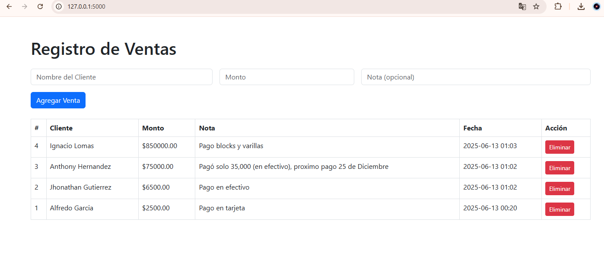

# 🧾 Portal de Ventas (Flask)

Este es un sistema web básico para registrar ventas, incluyendo monto y notas, desarrollado con **Python**, **Flask** y **SQLite**. Ideal como base para aplicaciones comerciales simples o como proyecto de aprendizaje en desarrollo web backend. 




## 🚀 Funcionalidades

- Registro de ventas con campos de **monto** y **nota**.
- Almacenamiento en base de datos **SQLite**.
- Interfaz web simple y funcional con **HTML/Jinja2**.
- Backend estructurado con **Flask** y **SQLAlchemy**.

## 📦 Tecnologías utilizadas

- Python 3
- Flask
- Flask SQLAlchemy
- SQLite
- HTML + Jinja2

## ⚙️ Instalación y ejecución

1. Clona el repositorio:

```bash
git clone https://github.com/Johan-M01/portal-ventas-flask.git
cd portal-ventas-flask
# Instala las dependencias
pip install flask flask_sqlalchemy

# Ejecuta la aplicación
python app.py
Una vez ejecutado, abre tu navegador en: [http://127.0.0.1:5000](http://127.0.0.1:5000)
