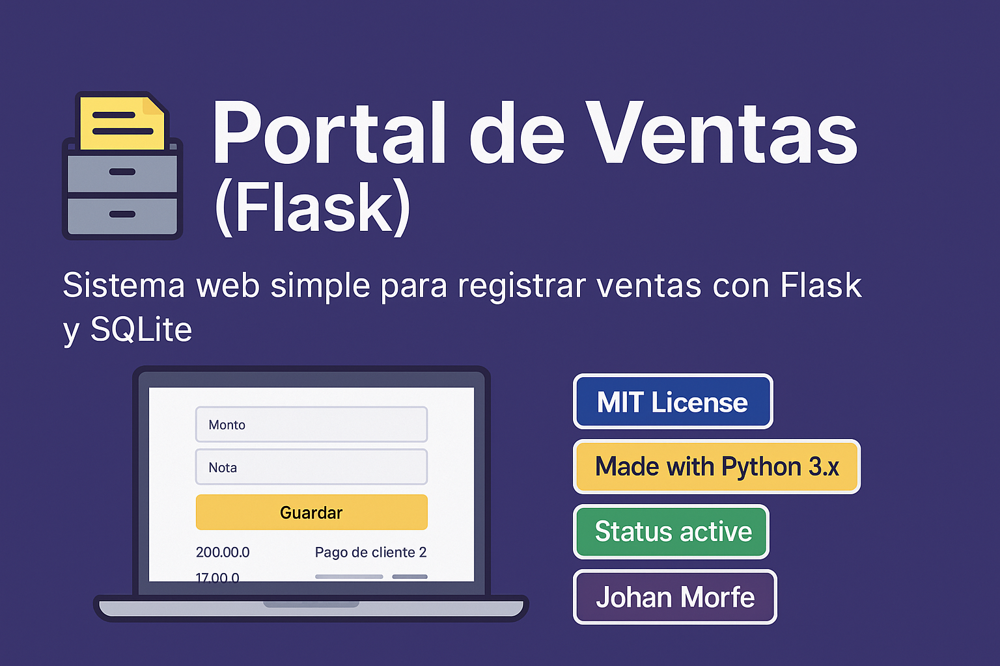

# 🧾 Portal de Ventas (Flask)

[](LICENSE)
[](https://www.python.org/)
[](#)
[](https://github.com/Johan-M01)

---

**Portal de Ventas** es un sistema web simple para registrar ventas con campos de **monto** y **nota**, desarrollado con **Flask** y **SQLite**. Ideal como base para apps comerciales ligeras o proyectos educativos de backend.

<br>

## 🎬 Demo


<br>

## 🚀 Funcionalidades

- 📝 Registro de ventas con monto y notas.
- 🧠 Almacenamiento en base de datos **SQLite**.
- 🖥️ Interfaz web simple usando **HTML + Jinja2**.
- ⚙️ Backend con **Flask** y **SQLAlchemy**.

<br>

## 🧰 Tecnologías utilizadas

- Python 3
- Flask
- SQLite
- SQLAlchemy
- HTML5 / Jinja2

<br>

## ⚙️ Instalación y ejecución

1. Clona el repositorio:

```bash
git clone https://github.com/Johan-M01/portal-ventas-flask.git
cd portal-ventas-flask
